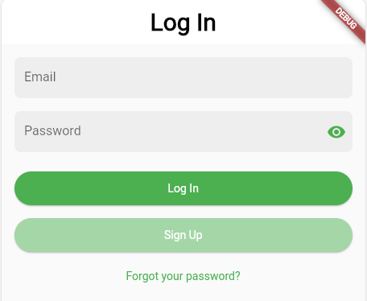
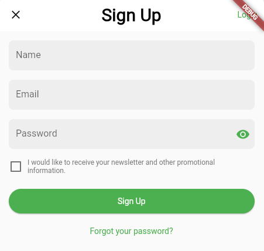
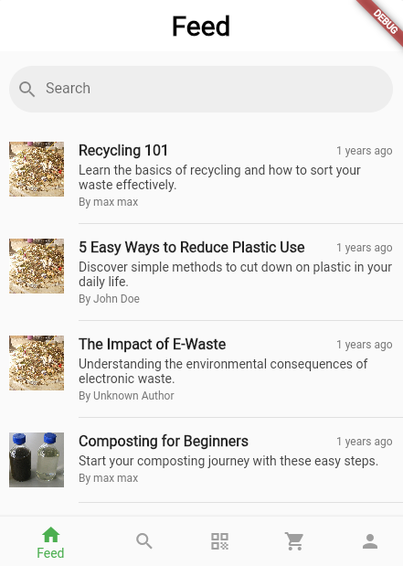
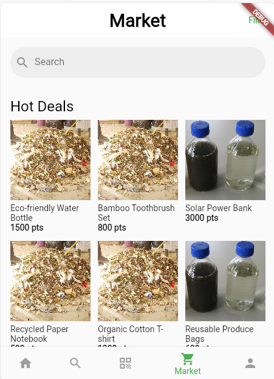
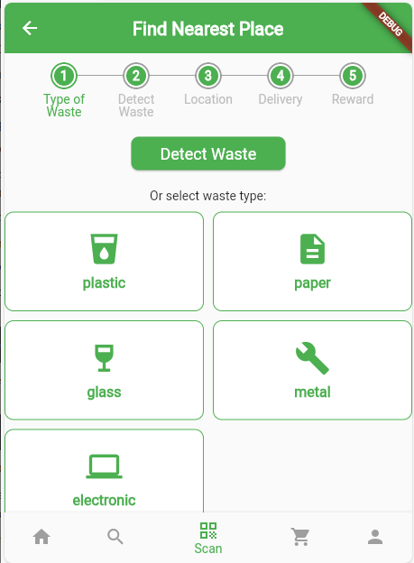
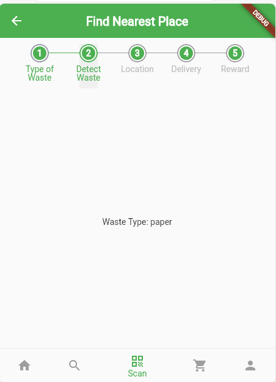
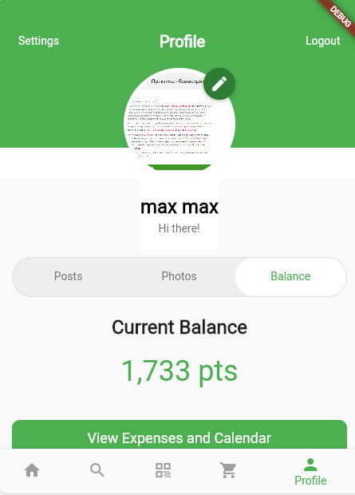
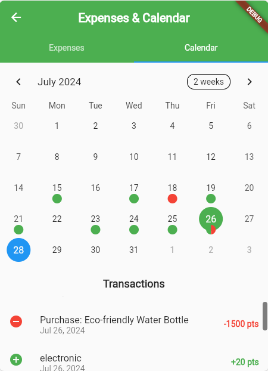

# 🌍 Recycle-M: Your Eco-Warrior's Digital Sidekick! 🦸‍♀️🦸‍♂️

## 🚀 Welcome to the Green Revolution!

Are you ready to save the planet, one recycled item at a time? Look no further! Recycle-M is here to transform you from a casual Earth inhabitant into a full-fledged eco-warrior! 🌱💪

## 🎭 What's This Green Magic All About?

Recycle-M isn't just an app; it's your ticket to the exclusive "I'm Saving the Planet" club! Here's what you get:

- 🔐 VIP Access: Sign up and log in to join the eco-elite!
- 📰 Green Gossip: A feed packed with earth-shattering articles and searchable eco-wisdom!
- 🛒 Eco-Bazaar: Shop 'til you drop (but sustainably, of course)!
- 🔍 Seek & You Shall Find: Our search function is like Google, but greener!
- 💸 Penny-Pinching for the Planet: Track your green expenses and watch your eco-savings grow!
- 📅 Save the Date: Calendar features to plan your world-saving activities!
- 📊 Insight Overload: Dive deep into your balance and expenses (Warning: May cause excessive pride in your eco-efforts)!
- ⚙️ Tailor Your Experience: Customizable user options (because even heroes need preferences)!
- 🦸 Your Eco-Identity: A profile that showcases your green superpowers!
- 🗑️ Waste Not, Want Not: Our state-of-the-art waste collection flow (It's like Uber, but for trash)!

## 🛠️ Crafted with Love (and Code)

Our digital eco-lair is built with:

- 🐍 Python (Because even snakes care about the environment)
- 🚀 FastAPI (For speed that doesn't cost the Earth)
- 🗃️ SQLAlchemy (Organizing data like a boss)
- 📦 SQLite (Lightweight, just like your carbon footprint should be)
- 🎨 Flutter (For a smooth, cross-platform frontend experience)

## 🚀 How to Start Your Eco-Journey

### Prerequisites

- Python 3.11+
- Flutter SDK
- Docker (optional)

### Installation

1. Clone the repository:

    ```bash
    git clone https://github.com/HardMax71/Recycle-M.git
    cd Recycle-M
    ```

2. Set up the backend:

    ```bash
    cd backend
    python -m venv .venv
    source .venv/bin/activate  # On Windows use .venv\Scripts\activate
    pip install -r requirements.txt
    ```

3. Set up the frontend:

    ```bash
    cd ../frontend
    flutter pub get
    ```

### Running the App

1. Start the backend:

    ```bash
    cd backend
    uvicorn main:app --reload
    ```

2. Start the frontend:

    ```bash
    cd frontend
    flutter run -d chrome # or any other device
    ```

### Docker Setup (Optional)

If you prefer using Docker:

1. Build the Docker image:
    
    ```bash
    docker build -t recycle-m .
    ```
   
2. Run the Docker container:

    ```bash
    docker run -p 8000:8000 -p 5000:5000 recycle-m
    ```
   
Visit `http://localhost:5000` in your browser to access the application.

## 📸 Sneak Peek into Our Eco-Paradise

<details>
  <summary>Click to expand</summary>

  <p align="center">
    
    <br>
    <span style="font-size: small; color: grey;">Secure login to access your eco-warrior dashboard</span>
  </p>

  <p align="center">
    
    <br>
    <span style="font-size: small; color: grey;">Join the green revolution with our easy sign-up process</span>
  </p>

  <p align="center">
    
    <br>
    <span style="font-size: small; color: grey;">Stay updated with the latest eco-friendly news and tips</span>
  </p>

  <p align="center">
    
    <br>
    <span style="font-size: small; color: grey;">Shop sustainably in our eco-friendly marketplace</span>
  </p>

  <p align="center">
    
    <br>
    <span style="font-size: small; color: grey;">Start your waste collection journey with ease</span>
  </p>

  <p align="center">
    
    <br>
    <span style="font-size: small; color: grey;">Locate nearby recycling centers for efficient disposal</span>
  </p>

  <p align="center">
    
    <br>
    <span style="font-size: small; color: grey;">Track your eco-impact and recycling rewards</span>
  </p>

  <p align="center">
    
    <br>
    <span style="font-size: small; color: grey;">Plan your eco-activities and never miss a green event</span>
  </p>

</details>

## 🎬 Ready to Star in Your Own Eco-Adventure?

Follow the installation guide above and start your journey to becoming an eco-warrior today!

## 🤝 Join Our League of Extraordinary Recyclers

We welcome contributions from all eco-enthusiasts! Check out our [CONTRIBUTING.md](CONTRIBUTING.md) for guidelines on how to join our mission.

## ⚖️ Legal Mumbo-Jumbo (But Important!)

DISCLAIMER: This application utilizes intellectual property, including but not limited to application descriptions and design elements, originally conceived and published by Ana Elisa Renault. The foundational concept and user experience design can be found in the article "The Making of a Recycling App — User Case" available at https://bootcamp.uxdesign.cc/the-making-of-a-recycling-app-user-case-cf7007bde3fe. The visual design elements are sourced from https://www.figma.com/design/VSuuWHIbFbAsDSp2OxNunI/Recycle-M?node-id=30-2365&t=VFKXuHo12ImVsc6q-0. 

This implementation is intended for educational and demonstrative purposes only. All rights and credits for the original concept and design belong to their respective owners. Any use, reproduction, or adaptation of this work should be done with full acknowledgment and in compliance with applicable intellectual property laws.

## ⚖️ License

This project is licensed under the MIT License - see the [LICENSE.md](LICENSE.md) file for details.

## 📞 Contact the Earth's Mightiest Coders

For inquiries, suggestions, or to join our league of extraordinary developers, please refer to the repository owner's profile for contact information. Together, we can code a greener future! 🌿💻🌍

Remember, in the green world of Recycle-M, every day is Earth Day! 🌎🎉
